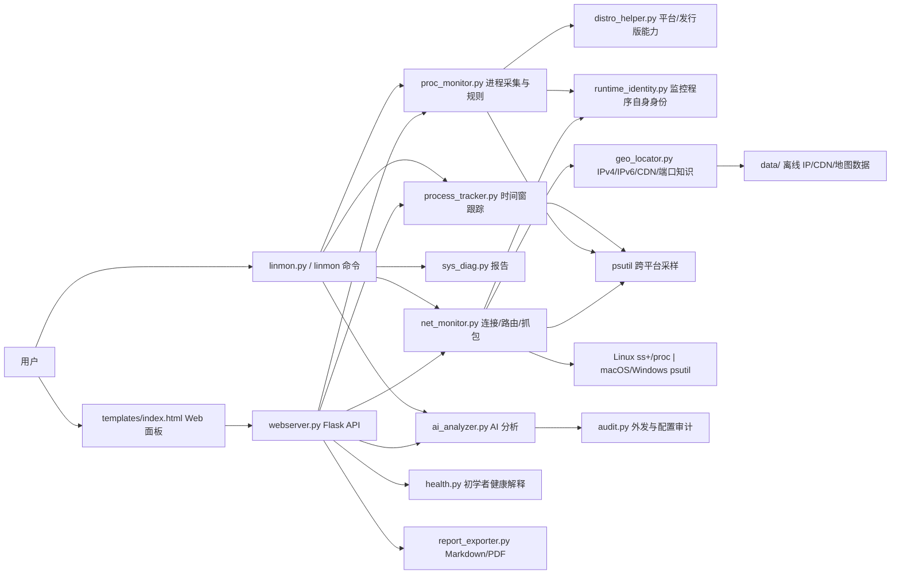
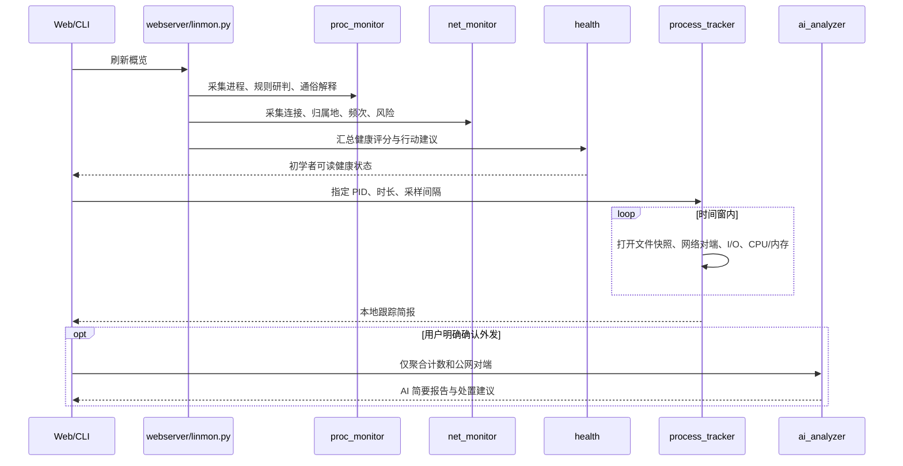

# linmon 代码图谱与功能盘点

更新时间：2026-08-24

## 1. 运行时总图

## 2. 请求与数据流

## 3. 模块职责

| 模块 | 核心职责 | 主要调用者 |
|---|---|---|
| `linmon.py` | CLI 参数、进程/网络/诊断/路由/跟踪命令 | 终端用户 |
| `webserver.py` | Flask API、鉴权、5 秒扫描缓存、Web 服务启动 | `templates/index.html` |
| `modules/proc_monitor.py` | 进程树、启动项、端口、恶意特征、风险分级、初学者说明 | CLI、Web、诊断 |
| `modules/net_monitor.py` | TCP/UDP 连接、方向/端口/地区风险、频率、路由、抓包 | CLI、Web、诊断 |
| `modules/process_tracker.py` | 对单 PID 做有界时间窗采样并形成简报 | CLI、Web API |
| `modules/health.py` | 把扫描结果转换为健康评分、通俗结论和行动建议 | Web 概览 |
| `modules/runtime_identity.py` | 保存 linmon 自身 PID/监听端口，阻止自身端口误报 | Web、进程、网络 |
| `modules/geo_locator.py` | 私网判断、IPv4/IPv6 离线归属地、CDN、端口与 TTL 知识 | 网络、路由、抓包 |
| `modules/distro_helper.py` | Linux 发行版、macOS、Windows 的服务/防火墙能力差异 | 进程、诊断 |
| `modules/ai_analyzer.py` | 脱敏、最小化外发、单项/综合/跟踪 AI 报告 | CLI、Web |
| `modules/sys_diag.py` | 文本、CSV、JSON 系统诊断报告 | CLI |
| `modules/report_exporter.py` | AI 报告 Markdown/PDF 导出 | Web |
| `modules/db_updater.py` | 更新 IPv4、IPv6、CDN 离线数据库 | CLI |
| `modules/audit.py` | 记录 AI 外发、配置变更、跟踪启动等安全事件 | Web、AI |
| `templates/index.html` | 单文件仪表盘、表格、地图、跟踪/AI 弹窗 | 浏览器 |
| `Skill-for-Agent/` | 可独立分发给智能体的安全扫描技能与脚本 | 智能体运行时 |

## 4. 当前已实现功能

- 进程：基本信息、进程树、资源占用、监听端口、连接、Linux cron/systemd/init、macOS launchd、自定义恶意规则与哈希库。
- 网络：Linux `ss`/`/proc` 与 macOS/Windows `psutil` 采集、连接聚合、方向/端口/地区风险、后台频率采样。
- 网络分析：IPv4/IPv6 离线归属地、CDN 标注、TTL 对端系统猜测、路由跟踪、本地抓包与 SNI/Host 提取。
- 展示：CLI、带令牌鉴权的 Web 面板、世界地图、排序/筛选、综合概览。
- 报告：文本/CSV/JSON、AI Markdown/PDF、安全审计日志。
- AI：进程、连接、路由、综合报告；敏感字段脱敏、内网/监听端口默认不外发、外发确认。
- 初学者体验：进程/连接通俗说明、系统健康评分、建议动作。
- 可疑进程跟踪：时间窗内观察打开文件、网络对端与频次、I/O、CPU/内存；本地简报及可选 AI 整理。
- 自身端口识别：仅把 Web 服务实际 PID 与最终选定端口标为 linmon 自身安全监听。

## 5. 三系统兼容矩阵

| 能力 | Linux | macOS | Windows |
|---|---|---|---|
| 进程基础信息 | psutil | psutil | psutil |
| 网络连接 | `ss` + `/proc` | psutil | psutil |
| 可疑进程采样跟踪 | psutil | psutil | psutil |
| 自启动关联 | cron/systemd/init | launchd | 当前仅安全降级，待接 `schtasks` |
| 路由跟踪 | traceroute/mtr/tracepath | traceroute | tracert |
| 防火墙状态 | ufw/firewalld/iptables | Application Firewall/pf | `netsh advfirewall` |
| 抓包 | tcpdump/tshark | tcpdump/tshark | tshark 基础路径，需 Npcap/接口适配验证 |
| 安装脚本 | 支持 | 支持 | 尚缺 PowerShell 安装脚本 |

## 6. 关键风险与后续优先级

1. `Skill-for-Agent/scripts` 与 `modules` 存在扫描、地理、路由规则的重复实现，长期会发生规则漂移；建议让技能脚本复用核心包或自动同步规则。
2. 便携跟踪器的文件数是“采样时仍打开的文件”，短暂打开后立即关闭的文件可能漏记。完整审计需分别接 Linux audit/eBPF、Windows ETW/Sysmon、macOS Endpoint Security。
3. Windows 核心采集路径已经建立，但需要 Windows CI/真实机器验证，并补 PowerShell 部署、任务计划关联和 Npcap 接口选择。
4. Web 前端是 1600 行单文件，HTML/CSS/JS 耦合较高；后续新增功能前宜拆成页面组件、API 客户端和状态模块。
5. 频率样本与跟踪会话目前只保存在内存中，服务重启后丢失；生产版应使用 SQLite，并设置保留期和敏感数据清理策略。
6. 健康评分是解释层，不应作为唯一安全结论；后续应把规则置信度、权限缺失和采集覆盖率同时展示。
